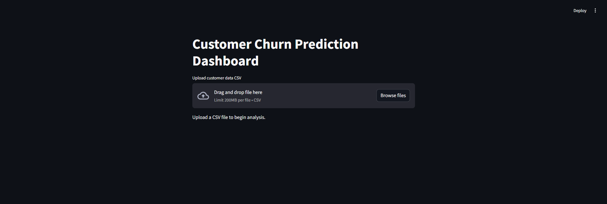

# Customer Churn Prediction Project

[](https://www.python.org/) 
<<<<<<< HEAD
[](https://streamlit.io/)
=======
[](https://streamlit.io/) 
>>>>>>> c30b6f464676c526361d8c10a921ed18a64e8611

---

## 🚀 Overview
A production-ready, end-to-end pipeline for predicting customer churn using the Telco Customer Churn dataset. This project features advanced feature engineering, robust modeling, model explainability with SHAP, customer segmentation, a REST API, and an interactive Streamlit dashboard.

---

## 🌟 Quickstart
| Step                | Command                                    |
|---------------------|--------------------------------------------|
| Install dependencies| `pip install -r requirements.txt`          |
| Run pipeline        | `python main.py`                           |
| Start API           | `uvicorn api:app --reload`                 |
| Launch dashboard    | `streamlit run dashboard.py`               |

---

## 📊 Dashboard Preview

*Replace `dashboard_screenshot.png` with a real screenshot of your dashboard for best results!*

---

## 🧩 Features
- **Data cleaning & preprocessing**
- **Advanced feature engineering** (tenure buckets, service counts, interaction terms)
- **EDA & customer segmentation** (KMeans clustering)
- **Multiple models** (Logistic Regression, Random Forest, XGBoost) with cross-validation
- **SHAP-based model explainability** (feature importance, force plots)
- **FastAPI** for real-time predictions
- **Streamlit dashboard** for interactive exploration
- **Professional, modular codebase**

---

## 🛠️ Project Structure
```
├── data_preprocessing.py     # Data loading and cleaning
├── feature_engineering.py    # Feature creation
├── eda.py                    # EDA and clustering
├── modeling.py               # Model training and evaluation
├── explainability.py         # SHAP explainability
├── api.py                    # FastAPI REST API
├── dashboard.py              # Streamlit dashboard
├── utils.py                  # Helper utilities
├── requirements.txt          # Dependencies
├── README.md                 # Project documentation
└── .gitignore                # Git exclusions
```

---

## 📈 Business Recommendations
- Target 'Month-to-month' contract customers with loyalty incentives.
- Focus retention on customers with high monthly charges and short tenure.
- Offer bundled services to increase stickiness and reduce churn.
- Monitor high-risk clusters for proactive outreach.

---

## 🙌 Contributing
Pull requests are welcome! For major changes, please open an issue first to discuss what you would like to change.

---

## ⭐️ Star this repo if you like the project!
- `api.py`: FastAPI endpoint
- `dashboard.py`: Streamlit dashboard
- `main.py`: Pipeline runner
- `requirements.txt`: Dependencies
- `README.md`: Project documentation

## Dataset
- [WA_Fn-UseC_-Telco-Customer-Churn.csv](https://www.kaggle.com/blastchar/telco-customer-churn)

---

**Showcase your data science skills with this project!**
